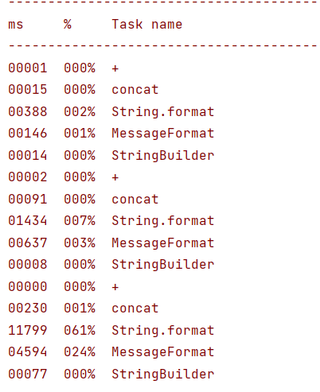

1. \+                                             
    - 想偷懒就用，无所谓了，
2. concat()                                   
    - 比4.5有很大优势，就是如果有分隔符可能会比较长，存在忘记之类的问题
3. StringUtils.join()                      
    - 没成功，待补充
4. String.format()                       
    - 用5吧
5. MessageFormat.format()       
    - 比4，快
6. StringBuilder、StringBuffer    
    - 最快

结论：
<br> StringBuilder、StringBuffer最快没有疑问；<br> concat()似乎也挺快的；<br> MessageFormat.format() > String.format();<br>  + 最方便，偷懒就用<br> 
 StringUtils.join()；好像没测成功，后续补充
```java
public static void main(String[] args) {
        int[] arr = new int[]{100000, 1000000, 10000000};
        StopWatch stopWatch = new StopWatch("Test String");
        for (int item : arr) {

            stopWatch.start("+");
            for (int i = 0; i < item; i++) {
                String s =  "1111" + "2222" +"3333"+ "4444";
            }
            stopWatch.stop();

            stopWatch.start("concat");
            for (int i = 0; i < item; i++) {
                String s = "";
                s.concat("1111");
                s.concat("2222");
                s.concat("3333");
                s.concat("4444");
            }
            stopWatch.stop();

            stopWatch.start("String.format");
            for (int i = 0; i < item; i++) {
                String s = String.format("%s,%s,%s,%s", "1111", "2222", "3333", "4444");
            }
            stopWatch.stop();

            stopWatch.start("MessageFormat");
            for (int i = 0; i < item; i++) {
                String s = MessageFormat.format("{0},{1},{2},{3}", "1111", "2222", "3333", "4444");
            }
            stopWatch.stop();

            stopWatch.start("StringBuilder");
            StringBuilder sbd;
            for (int i = 0; i < item; i++) {
                sbd = new StringBuilder();
                String s = sbd.append("1111").append(",")
                        .append("2222").append(",")
                        .append("3333").append(",")
                        .append("4444").toString();
            }
            stopWatch.stop();
        }
        System.err.println(stopWatch.prettyPrint());
    }
```
